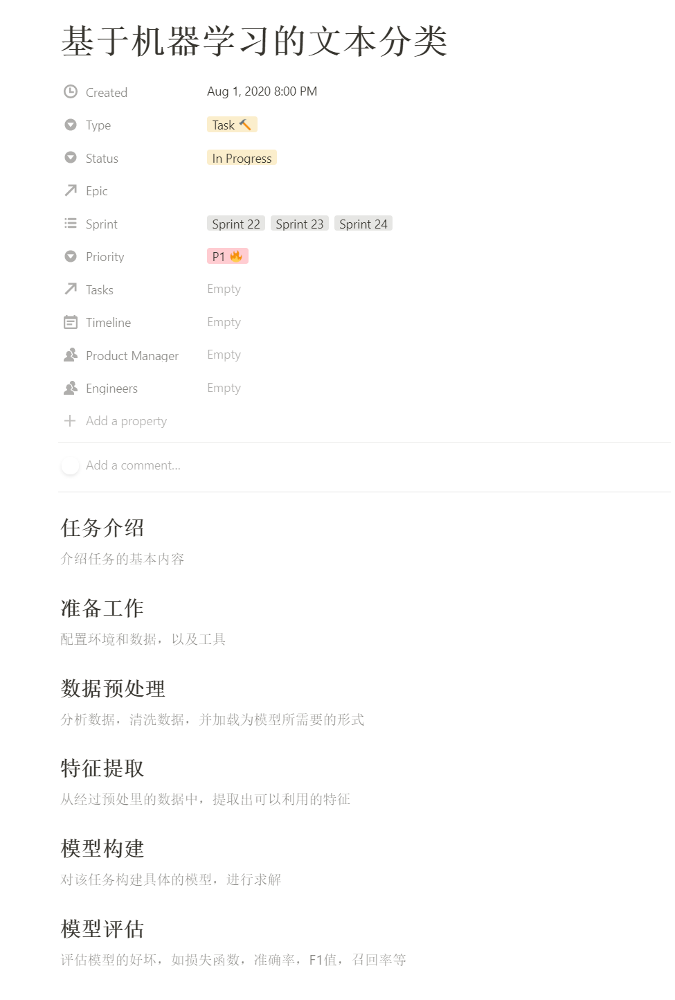

本仓库为 [FudanNLP/nlp-beginner](https://github.com/FudanNLP/nlp-beginner) 外加另两个NLP任务的实现。
每个任务文件夹都包含一个 README.md 文件，用来说明每个任务的处理流程，md文件模板如下图所示：

------
### TODOS：
- [ ] [Task1:基于机器学习的文本分类](./task1/#)
- [ ] [Task2:基于神经网络的文本分类](./task2/#)
- [ ] [Task3:基于注意力机制的文本匹配](./task3/#)
- [ ] [Task4:基于BiLSTM+CRF的命名实体识别](./task4/#)
- [ ] [Task5:基于神经网络的语言模型](./task5/#)
- [ ] [Task6:基于seq2seq(attention)的机器翻译](./task6/#)
- [ ] [Task7:基于transformer的机器翻译](./task7/#)
